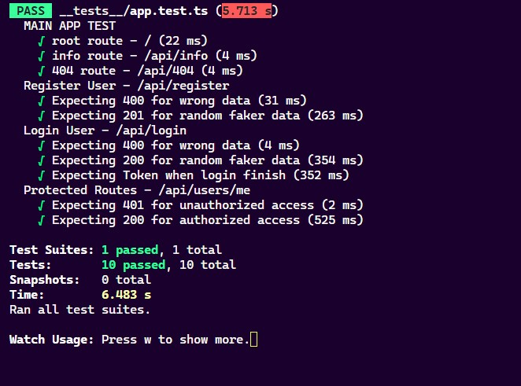

# Project Details

### **Technology Stack Used:**

* Node.js (v20)
* TypeScript
* Express
* MongoDB
* Mongoose ORM
* Jest
* Supertest
* Postman

## Project Setup Guideline

### Start The Server Procedures

1. Clone the repo
2. Go to the project directory
3. Copy the .env file into the project directory
4. Run the following command to install packages in terminal `npm i`
5. To **start the development** server run this command in terminal `npm run dev`
6. To **build** the project run this command in terminal `npm run build`
7. To **start the production** server run this command in terminal `npm run start`
8. Open a browser and goto [localhost:5000](http://localhost:5000) you should see "Hello, Node.js!" in the screen

### Start Test Procedures

1. Start the server in one terminal window by running this command `npm run dev`  or `npm run build:start`
2. Open another terminal window and run this command `npm run test`
3. If the test case fails please run the command again, it fails because of the fake data seeding library

### Docker Setup Procedures

1. Install docker in the system *follow the guide* [Docker Doocumentation](https://docs.docker.com/)
2. Run "Docker Destop" application in windows to run docker locally
3. Run this command to build with docker in terminal `docker build -t uss-assessment .`
4. Run this command to start the app with Docker in terminal `docker run -p 8080:5000 uss-assessment`
5. open a browser and go to [localhost:8080](http://localhost:8080/)

### API Documentation

1. Open Postman in your machine
2. Click on `Import` button
3. Drag and Drop the `uss-assessment-api.postman_collection.json` file located in project directory's `postman-api-documentation` folder
4. Select a request from the collection and hit `Send` button
5. All the examples of the request are in each request's drop down
6. Click each example to view the headers and response
